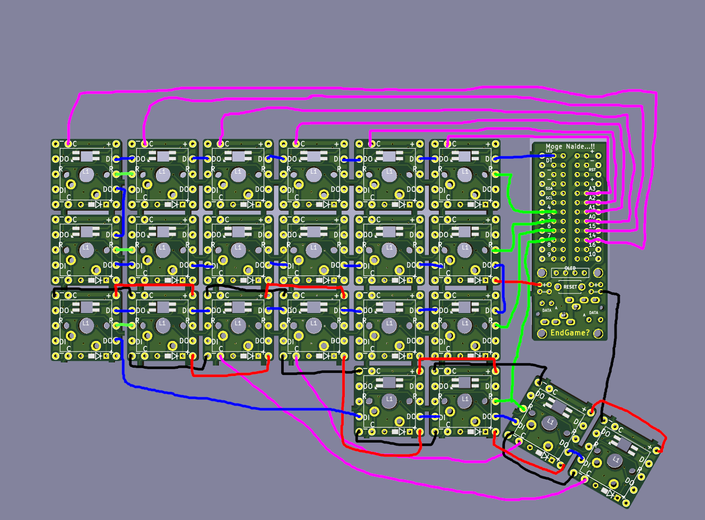

# 无限的可能性

[Cherry-Mx-Bitboard](https://github.com/ogatatsu/Cherry-Mx-Bitboard)已被修改，因此SK6812mini会因螺旋而上瘾。

自制键盘的印刷板，一个板对应一个开关。

使用此板子，您无需设计板子就可以制作具有原始布局的全色背光键盘。

例如 ...！

[单击此处了解](https://swan-match.hatenablog.com/entry/2018/09/15/184923)详细信息。

我们已经发布了[如何制作顶板的方法](https://swanmatch.github.io/topplate_tips)。

# 语言能力

- [日本](./readme.md)
- [英语](./readme_en.md)
- [法文](./readme_fr.md)
- [俄语](./readme_ru.md)
- [中文](./readme_zh.md)

## 无限可能性系列

### 宝微之家

ProMicro的Pin可以通过OLED，复位开关，TRRS（用于拆分键盘）和M2螺孔（用于安装）取出。
 TRRS引脚分配与Helix兼容。

### 无限可能性系列

有多种无限的可能性，每种可能性都有不同的对应LED和开关二极管。
规格摘要如下。

项目 | 开关 | 凯尔插座的可用性 | LED | 通孔二极管 | SOD-123
--- | --- | --- | --- | --- | ---
关系 | MX | 没有 | SK6812MINI | 是 | 没有
Altana | MX | 是 | SK6812MINI | 是 | 没有
苏克森 | MX | 没有 | YS-SK6812MINI | 是 | 是（*）
容器 | MX | 是 | YS-SK6812MINI | 是 | 是（*）
巧克力 | KailhLowProfile | 没有 | YS-SK6812MINI | 没有 | 是

（*）当将SOD-123与Swen和容器一起使用时，由于空间限制，一个垫将与通孔共用，因此实施起来会有些棘手。

## 物料示例（供应商）

- 任意切板
    - 2mm亚克力板（Yusha Kobo）
        最好使用3mm丙烯酸方和丙烯酸圣代等粘合剂。 （居家中心）
    - 3D外壳（DMM.make）
    - 5毫米纸板（从该区域等捡起）
- 开关二极管1N4148，SOD-123（TALP键盘）
- SK6812mini，YS-SK6812MINI-E（Yusha Kobo）
- Kailh套接字（Yusha Kobo，Talpkeyboard，Kbdfans）
- 氨基甲酸乙酯漆包线（推荐约0.35至0.45毫米。也可在家庭中心等处使用。也可以使用乙烯基线，但很难熔化）
- TRRS插孔，RESET按钮（秋月电机）
- OLED（可选，Yusha Kobo）
- Promicro（Yusha Kobo，TALP键盘）
- 各种垫片，螺丝（广ros惠子先生，威尔科先生等）
- 按键开关，键帽（Yusha Kobo，Talp键盘等，如果您愿意）
- USB电缆，TRS（3.5mm 3极）电缆

需要其他工具，例如温度控制烙铁，测试仪和镊子。

## 引脚分配

具有无限可能性的引脚排列是：

- C：水平线（Col）
- R：垂直线（行）
- DI：LED控制信号输入（DataIn）
- DO：LED控制信号输出（DataOut）
- -：接地（用于LED）
- +：VCC（LED为5V）

图片中的示例是Suxen，但其他示例相似。

## 组装程序

1. 焊接SK6812mini。
    使用温度控制烙铁在约220°C的温度下进行焊接。
    如果您依靠它，它将断裂。
    使用熔点为200°C或更低的低温焊料。
2. 焊接二极管。
3. 将开关放置在顶板上，然后将开关支脚焊接在背面，以无尽的可能。 （Altana，容器是一个套接字）
    如果此时使用2mm的丙烯酸板，建议使用丙烯酸粘合剂将3mm的丙烯酸方格粘贴到板背面的开关侧面，以防止开关脱落。
4. 根据要构建的键盘的键矩阵连接水平线（Col）和垂直线（Row）。
5. 连接所有的“-”和“ +”。
6. 按照您希望LED发光的顺序从DI到DO布线。第一DO→第二DI→第二DO→第三DI…
7. 焊接TRRS JACK和RESET开关。
8. 焊接OLED插座。
9. 从任何引脚旁边的孔中连接Col和Row，LED（DO），GND和VCC，以实现无限可能。
10. 将Promicro焊接到插座上。
     （您可以使用连接器，但如果整个插座坏了，则更换整个插座要便宜一些。）
11. お好みに合わせてファームウェアを作成して書き込んで完成。
     ファームウェアは[QMK_Firmware](https://github.com/qmk/qmk_firmware)を使うととても簡単です。
     参考: [自作キーボードのファームウェアを用意する手段3種類](https://skyhigh-works.hatenablog.com/entry/2018/10/09/120909)

## 接线实例

例如，在以下Suxen布置中，接线如下。
由于很难去除氨基甲酸乙酯漆包线（UEW）上的涂层，因此建议切断用于相邻板之间布线的二极管脚，这样就不太可能引起短路。

### 笔记

- Altana和Container是允许您使用Kailh插槽更换交换机的版本。
- Suxen和Container与YS-SK6812MINI兼容，并根据PCB的三角丝安装缺少LED的支脚。
- 如果在极少数情况下不需要点亮LED，则仅可接线Col和Row以用作键盘。[接线实例](./images/Wired.png)
- 对于在日本经常使用的三明治式安装键盘，在顶板和底板上放置了垫片，但是在无限可能的情况下，键之间没有空间可以进入垫片。在钥匙的外侧开一个螺丝孔。
- 如果先将Promicro焊接到“房屋”，则在布线到无限可能的一侧时，焊料可能会从孔中漏出，从而导致Promicro主机部件短路。
    确保最后焊接Promicro。

## 在最后

使用此板构建键盘时，请通过[@swan_match](https://twitter.com/swan_match)与我们联系。

我们支持您的最终游戏！ !!

## 执照

https://creativecommons.org/licenses/by/4.0/
